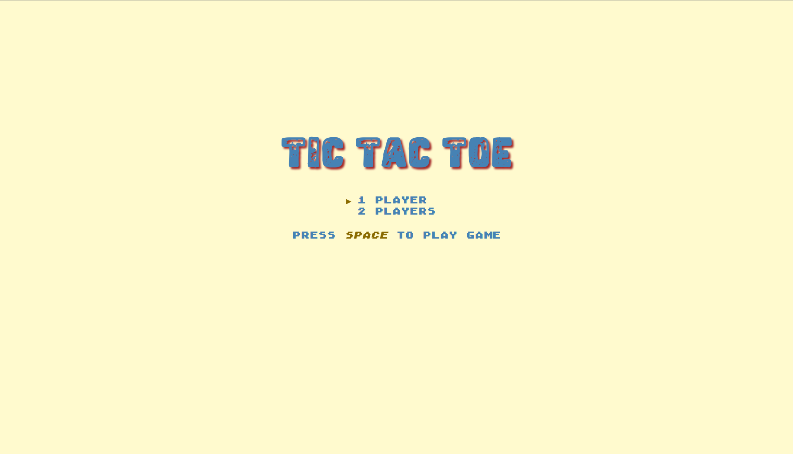
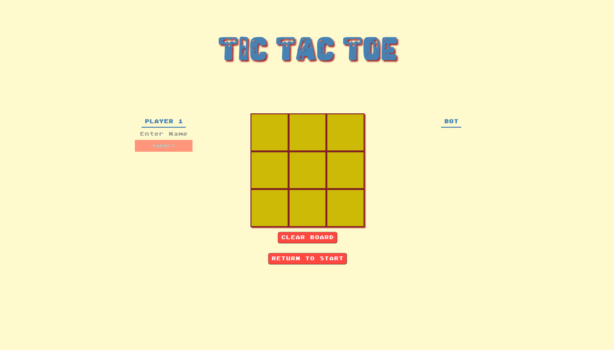

# Tic Tac Toe
Simple game of tic tac toe. Play against a bot or a friend with this nostalgic title.

[Live Preview](https://github.com/bchung54/tic-tac-toe)

# Journey Through the TOP: My Web Dev Journey [(The Odin Project)](https://theodinproject.com/)

[Project #1: Recipes](https://github.com/bchung54/odin-recipes) [HTML]

[Project #2: Landing Page](https://github.com/bchung54/landing-page) [HTML | CSS + flexbox]

[Project #3: Rock Paper Scissors](https://github.com/bchung54/rockpaperscissors) [HTML | CSS | JavaScript]

[Project #4: Etch-a-Sketch](https://github.com/bchung54/etch-a-sketch) [HTML | CSS | JavaScript + events]

[Project #5: Calculator](https://github.com/bchung54/calc-project) [HTML | CSS | JavaScript]

[Project #6: Sign-up Form](https://github.com/bchung54/sign-up-form) [HTML | CSS | JavaScript]

[Project #7: Admin Dashboard](https://github.com/bchung54/admin-dashboard) [HTML | CSS | JavaScript]

[Project #8: Library](https://github.com/bchung54/library-project) [HTML | CSS | JavaScript + Objects]

[Project #9: Tic Tac Toe](https://github.com/bchung54/tic-tac-toe) [HTML | CSS | JavaScript + Factory Functions + The Module Pattern]

[Project #10: Restaurant Page](https://github.com/bchung54/restaurant-page) [HTML | CSS | JavaScript + ES6 Modules + Webpack]

